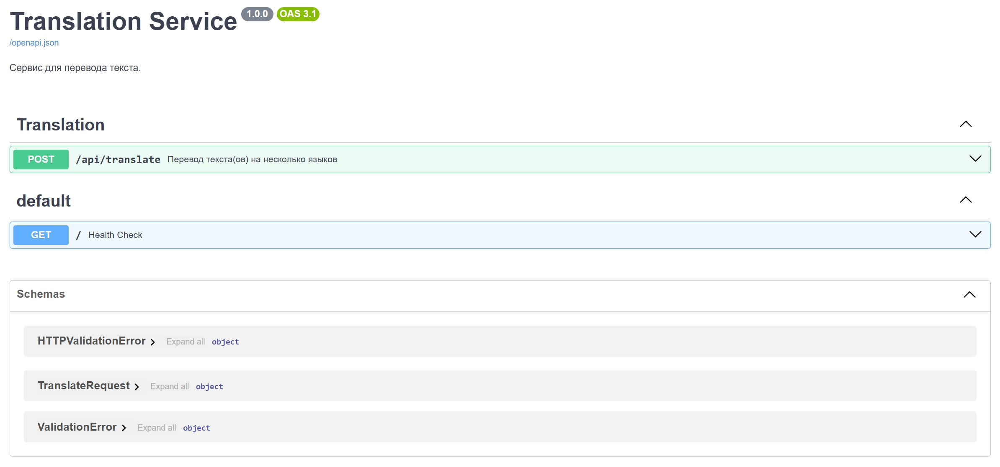

# Translation API

Это сервис для перевода текста с использованием модели **M2M100** от Facebook. API поддерживает перевод текста на несколько языков, а также работу с несколькими текстами и зыками.

  

## Установка локально

1. Клонируйте репозиторий:

   ```bash
   git clone https://github.com/AntonSHBK/language_translator_mBART_50.git
   cd language_translator_mBART_50
   ```

2. Создайте виртуальное окружение:

   ```bash
   python -m venv .venv
   ```

3. Активируйте виртуальное окружение:
   - Для Windows:

     ```bash
     .\.venv\Scripts\activate
     ```

   - Для MacOS/Linux:

     ```bash
     source .venv/bin/activate
     ```

4. Установите зависимости:

   ```bash
   pip install -r requirements.txt
   ```

## Параметры для модели

Модель использует **M2M100** от Facebook, которая поддерживает более 100 языков. Ниже приведены основные параметры, которые можно настроить при инициализации модели:

- **`model_name`**: Название модели для загрузки, по умолчанию `"facebook/m2m100_418M"`.
- **`cache_dir`**: Путь к директории для кэширования модели, по умолчанию `.app/data/cache`.

### Поддерживаемые языки

Вот таблица с пояснениями для каждого языка из **`SUPPORTED_LANGUAGES`**. В таблице указаны ISO коды языков, их полные названия и описание, если необходимо:

| Код языка | Полное название языка          | Описание/примечания                                  | Пример языка/страна     |
|-----------|--------------------------------|-----------------------------------------------------|-------------------------|
| af        | Африкаанс                      | Официальный язык в Южной Африке и Намибии.          | Южноафриканская Республика, Намибия |
| am        | Амхарский                      | Официальный язык Эфиопии.                           | Эфиопия                 |
| ar        | Арабский                       | Один из самых распространённых языков в мире.       | арабские страны, Египет |
| ast       | Астурийский                    | Язык в Испании, говорящийся в регионе Астурия.       | Испания (Астурия)       |
| az        | Азербайджанский                | Официальный язык Азербайджана.                      | Азербайджан             |
| ba        | Башкирский                     | Язык, говорящийся в Башкортостане, Россия.           | Россия (Башкортостан)   |
| be        | Белорусский                    | Официальный язык Белоруссии.                        | Беларусь                |
| bg        | Болгарский                     | Официальный язык Болгарии.                          | Болгария                |
| bn        | Бенгальский                    | Официальный язык Бангладеш и Западного Бенгалии, Индия. | Бангладеш, Индия        |
| br        | Бретонский                     | Кельтский язык, говорящийся в Бриттани (Франция).    | Франция (Бретань)       |
| bs        | Боснийский                     | Официальный язык Боснии и Герцеговины.              | Босния и Герцеговина    |
| ca        | Каталанский                    | Язык, говорящийся в Каталонии, Испания.             | Испания (Каталония)     |
| ceb       | Себуанский                     | Язык, говорящийся на Филиппинах.                    | Филиппины               |
| cs        | Чешский                        | Официальный язык Чехии.                             | Чехия                   |
| cy        | Валлийский                     | Официальный язык Уэльса, Великобритания.            | Великобритания (Уэльс)  |
| da        | Датский                        | Официальный язык Дании.                             | Дания                   |
| de        | Немецкий                       | Один из основных языков Европы.                     | Германия, Австрия, Швейцария |
| el        | Греческий                      | Официальный язык Греции.                            | Греция                  |
| en        | Английский                     | Один из самых распространенных языков в мире.       | Великобритания, США, Австралия |
| es        | Испанский                      | Один из мировых языков, широко используется в Латинской Америке и Испании. | Испания, Мексика, Аргентина |
| et        | Эстонский                      | Официальный язык Эстонии.                           | Эстония                 |
| fa        | Персидский                     | Официальный язык Ирана.                             | Иран                    |
| ff        | Фулах                           | Язык, распространённый в Западной и Центральной Африке. | Сенегал, Гамбия         |
| fi        | Финский                        | Официальный язык Финляндии.                         | Финляндия               |
| fr        | Французский                    | Один из мировых языков, официальный язык во многих странах. | Франция, Канада, Бельгия |
| fy        | Фризский                       | Язык, говорящийся в Нидерландах и Германии.          | Нидерланды, Германия    |
| ga        | Ирландский                     | Официальный язык Ирландии.                          | Ирландия                |
| gd        | Шотландский гэльский            | Язык, говорящийся в Шотландии.                      | Великобритания (Шотландия) |
| gl        | Галисийский                    | Язык, говорящийся в Галисии (Испания).              | Испания (Галисия)       |
| gu        | Гуджарати                       | Один из языков Индии.                               | Индия (Гуджарат)        |
| ha        | Хауса                          | Один из языков, распространённых в Западной Африке. | Нигерия, Нигер          |
| he        | Иврит                          | Официальный язык Израиля.                           | Израиль                 |
| hi        | Хинди                          | Официальный язык Индии.                             | Индия                   |
| hr        | Хорватский                      | Официальный язык Хорватии.                          | Хорватия                |
| ht        | Гаитянский креольский          | Язык, говорящийся в Гаити.                          | Гаити                   |
| hu        | Венгерский                      | Официальный язык Венгрии.                           | Венгрия                 |
| hy        | Армянский                       | Официальный язык Армении.                           | Армения                 |
| id        | Индонезийский                   | Официальный язык Индонезии.                         | Индонезия               |
| ig        | Игбо                            | Язык, говорящийся в Нигерии.                        | Нигерия                 |
| ilo       | Илоко                           | Язык, говорящийся на Филиппинах.                    | Филиппины               |
| is        | Исландский                      | Официальный язык Исландии.                          | Исландия                |
| it        | Итальянский                     | Официальный язык Италии.                            | Италия                  |
| ja        | Японский                        | Официальный язык Японии.                            | Япония                  |
| jv        | Яванский                        | Язык, говорящийся в Индонезии.                      | Индонезия               |
| ka        | Грузинский                      | Официальный язык Грузии.                            | Грузия                  |
| kk        | Казахский                       | Официальный язык Казахстана.                        | Казахстан               |
| km        | Кхмерский                       | Официальный язык Камбоджи.                          | Камбоджа                |
| kn        | Каннада                         | Один из языков Индии.                               | Индия                   |
| ko        | Корейский                       | Официальный язык Кореи.                             | Южная Корея, Северная Корея |
| lb        | Люксембургский                  | Официальный язык Люксембурга.                       | Люксембург              |
| lg        | Ганда                           | Язык, говорящийся в Уганде.                         | Уганда                  |
| ln        | Лингала                         | Язык, распространённый в Центральной Африке.        | Демократическая Республика Конго |
| lo        | Лаосский                        | Официальный язык Лаоса.                             | Лаос                    |
| lt        | Литовский                       | Официальный язык Литвы.                             | Литва                   |
| lv        | Латышский                       | Официальный язык Латвии.                            | Латвия                  |
| mg        | Малагасийский                   | Язык, говорящийся на Мадагаскаре.                   | Мадагаскар              |
| mk        | Македонский                     | Официальный язык Северной Македонии.                | Северная Македония      |
| ml        | Малаялам                        | Язык, говорящийся в южной Индии.                    | Индия (Керала)          |
| mn        | Монгольский                     | Официальный язык Монголии.                          | Монголия                |
| mr        | Маратхи                         | Один из языков Индии.                               | Индия (Махараштра)      |
| ms        | Малайский                       | Официальный язык Малайзии.                          | Малайзия                |
| my        | Бирманский                      | Официальный язык Мьянмы.                            | Мьянма                  |
| ne        | Непальский                      | Официальный язык Непала.                            | Непал                   |
| nl        | Голландский                     | Официальный язык Нидерландов.                       | Нидерланды              |
| no        | Норвежский                      | Официальный язык Норвегии.                          | Норвегия                |
| ns        | Северный сото                   | Язык, говорящийся в Южной Африке и Лесото.           | Южная Африка, Лесото    |
| oc        | Окситанский                     | Язык, говорящийся в Южной Франции.                  | Франция (Южная часть)   |
| or        | Ория                            | Язык, говорящийся в Индии.                          | Индия (Одиша)           |
| pa        | Панджаби                        | Один из языков Индии и Пакистана.                   | Индия, Пакистан         |
| pl        | Польский                        | Официальный язык Польши.                            | Польша                  |
| ps        | Пушту                           | Язык, говорящийся в Пакистане и Афганистане.        | Пакистан, Афганистан    |
| pt        | Португальский                   | Официальный язык Португалии, Бразилии и других стран. | Португалия, Бразилия    |
| ro        | Румынский                       | Официальный язык Румынии.                           | Румыния                 |
| ru        | Русский                         | Официальный язык России и других стран.             | Россия, Беларусь        |
| sd        | Синдхи                          | Язык, говорящийся в Пакистане.                      | Пакистан                |
| si        | Сингальский                     | Официальный язык Шри-Ланки.                         | Шри-Ланка               |
| sk        | Словацкий                       | Официальный язык Словакии.                          | Словакия                |
| sl        | Словенский                      | Официальный язык Словении.                          | Словения                |
| so        | Сомали                          | Официальный язык Сомали.                            | Сомали                  |
| sq        | Албанский                       | Официальный язык Албании.                           | Албания                 |
| sr        | Сербский                        | Официальный язык Сербии.                            | Сербия                  |
| ss        | Свати                           | Язык, говорящийся в Южной Африке.                   | Южная Африка            |
| su        | Сунданский                      | Язык, говорящийся в Индонезии.                      | Индонезия               |
| sv        | Шведский                        | Официальный язык Швеции.                            | Швеция                  |
| sw        | Суахили                         | Один из самых распространённых языков в Восточной Африке. | Кения, Танзания         |
| ta        | Тамильский                       | Один из языков Индии и Шри-Ланки.                   | Индия (Тамилнад), Шри-Ланка |
| th        | Тайский                         | Официальный язык Таиланда.                          | Таиланд                 |
| tl        | Тагальский                      | Официальный язык Филиппин.                          | Филиппины               |
| tn        | Тсвана                          | Язык, говорящийся в Южной Африке.                   | Южная Африка            |
| tr        | Турецкий                        | Официальный язык Турции.                            | Турция                  |
| uk        | Украинский                      | Официальный язык Украины.                           | Украина                 |
| ur        | Урду                            | Официальный язык Пакистана и Индии.                 | Пакистан, Индия         |
| uz        | Узбекский                       | Официальный язык Узбекистана.                       | Узбекистан              |
| vi        | Вьетнамский                     | Официальный язык Вьетнама.                          | Вьетнам                 |
| wo        | Волоф                           | Язык, говорящийся в Сенегале.                       | Сенегал                 |
| xh        | Косa                            | Язык, говорящийся в Южной Африке.                   | Южная Африка            |
| yi        | Идиш                            | Язык, говорящийся среди еврейских общин.             | Восточная Европа        |
| yo        | Йоруба                          | Язык, говорящийся в Нигерии.                        | Нигерия                 |
| zh        | Китайский                       | Один из мировых языков.                             | Китай                   |
| zu        | Зулусский                       | Язык, говорящийся в Южной Африке.                   | Южная Африка            |


## Запуск сервера

1. Для запуска серверного приложения используйте **Uvicorn**. Запустите сервер с помощью следующей команды (находясь в корне проекта):

   ```bash
   uvicorn app.main:app --host 0.0.0.0 --port 8000 --reload
   ```

   - **`--reload`**: Эта опция позволяет автоматически перезагружать сервер при изменениях в коде, что полезно для разработки.

2. После запуска сервера вы сможете получить доступ к API по адресу:

   ```
   http://127.0.0.1:8000/
   ```

3. Для тестирования API можно использовать **Swagger UI**, который доступен по следующему адресу:

   ```
   http://127.0.0.1:8000/docs
   ```

## Тестирование API

Для тестирования API можно использовать **cURL**, **Postman** или **requests**. Вот примеры для отправки запросов.

### Пример запроса для перевода текста

**POST** `/api/translate`

Этот запрос переводит один или несколько текстов на несколько языков.

#### Тело запроса:

```json
{
  "texts": ["The head of the United Nations says there is no military solution in Syria"],
  "source_lang": "en",
  "target_langs": ["fr", "es", "de"]
}
```

#### Ответ:

```json
{
  "translation": [
    {
      "fr": "Le chef des Nations Unies dit qu'il n'y a pas de solution militaire en Syrie",
      "es": "El jefe de las Naciones Unidas dice que no hay solución militar en Siria",
      "de": "UN-Chef sagt, es gibt keine militärische Lösung in Syrien"
    }
  ]
}
```

### Пример запроса для перевода одного текста

**POST** `/api/translate_single`

Этот запрос переводит один текст на один целевой язык.

#### Тело запроса:

```json
{
  "text": "The head of the United Nations says there is no military solution in Syria",
  "source_lang": "en",
  "target_lang": "fr"
}
```

#### Ответ:

```json
{
  "translation": "Le chef des Nations Unies dit qu'il n'y a pas de solution militaire en Syrie"
}
```

### Пример запроса для перевода батча текстов

**POST** `/api/translate`

Этот запрос переводит несколько текстов на несколько языков.

#### Тело запроса:

```json
{
  "texts": ["Hello, world!", "How are you?", "Good morning!"],
  "source_lang": "en",
  "target_langs": ["fr", "es", "de"]
}
```

#### Ответ:

```json
{
  "translation": [
    {
      "fr": "Bonjour, le monde!",
      "es": "¡Hola, mundo!",
      "de": "Hallo, Welt!"
    },
    {
      "fr": "Comment ça va?",
      "es": "¿Cómo estás?",
      "de": "Wie geht's?"
    },
    {
      "fr": "Bonjour!",
      "es": "¡Buenos días!",
      "de": "Guten Morgen!"
    }
  ]
}
```

## Документация API

Swagger UI генерирует документацию для вашего API, где вы можете увидеть все доступные маршруты и параметры:

1. **`POST /api/translate`**: Переводит текст на несколько языков.
   - **Тело запроса**:
     - `texts`: Список строк для перевода.
     - `source_lang`: Исходный язык текста (опционально, если не указано, определяется автоматически).
     - `target_langs`: Список целевых языков.
   - **Ответ**:
     - Возвращает переведенные строки для каждого языка в списке `target_langs` для каждого текста.

2. **`POST /api/translate_single`**: Переводит один текст на один целевой язык.
   - **Тело запроса**:
     - `text`: Строка для перевода.
     - `source_lang`: Исходный язык текста (опционально, если не указано, определяется автоматически).
     - `target_lang`: Целевой язык.
   - **Ответ**:
     - Возвращает переведенную строку для целевого языка.

3. **`POST /api/batch_translate`**: Переводит несколько текстов на несколько языков.
   - **Тело запроса**:
     - `texts`: Список строк для перевода.
     - `source_lang`: Исходный язык текста (опционально, если не указано, определяется автоматически).
     - `target_langs`: Список целевых языков.
   - **Ответ**:
     - Возвращает переведенные строки для каждого текста на все целевые языки. Каждый переведенный текст представлен словарем, где ключами являются коды целевых языков. 

## Логирование

Система логирования настроена на уровне INFO. Все ошибки и важные события записываются в лог.

## Тестирование

Для тестирования используется **pytest**. Запустите тесты с помощью команды:

```bash
 pytest app/tests/test_api.py -v
 pytest app/tests/test_translate.py -v
```

Тесты покрывают основные функции перевода текста и перевода батчей текстов.

## Контейнеризация (Docker)

Если вы хотите развернуть приложение в Docker, используйте **Dockerfile** и **docker-compose.yml**.

```bash
cd docker
docker-compose up --build
```